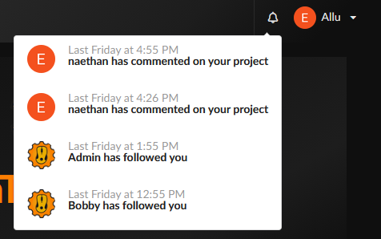
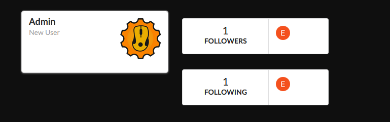
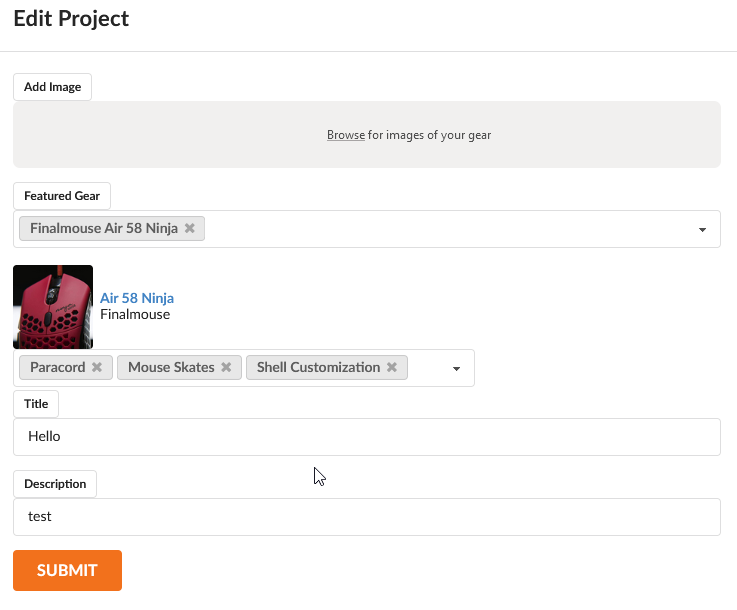

This is a smaller update for OnTheGears focusing on profile improvements. This includes a follower system and notification feed. These systems will allow members to find gear they are interested in and be up-to-date with other members' projects. I will talk about these two additions and some minor improvements in this blog post.

<!-- end -->

###Notification Feed

Notifications allow members to be alerted on specific occasions.When you login there will now be a bell next to your profile dropdown. When you click this bell it will show a feed of your latest notifications. As of now there are only two types of notifications: when a member posts on your project or follows you. Notifications will be used in tandem with the follower system to keep members up-to-date on the newest gear.

###Follower System

Members should be able to find each other reliably. The follower system is similar to systems seen on Twitter and other social platforms. When you follow another member, you will appear on their profile page and that member will be notified. I have done this using Firebase Cloud Functions, which allows the database to be updated on queue. As of now following is an empty gesture but I have greater plans for like notifying followers when a member updates their project or when they add a mouse to their collection.

###Editing Projects

When I released OnTheGears you could edit the Title and Content of your project, but that was it. This did not sit right. My idea of a project was for a user to post their new mouse and then over time, as they received parts, they would update their project to include the modified mouse. With this update you can now add images and gear, with mods, to a project.

This is a small update as I have been unfocused this month with the nice weather and spending less time on the computer. I hope to be more focused during these next few weeks and implement some more core features like keyboard support and a rich text editor.

Until next time,

_naethan_
